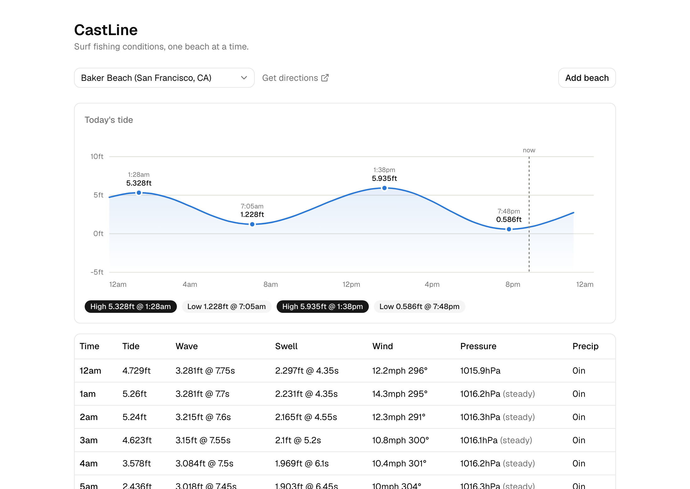

# CastLine

A surf fishing conditions app: pick a beach, see today's tide curve, waves, wind, and pressure in one place, normalized from three independent data sources.

**Live:** [castline-frontend-phi.vercel.app](https://castline-frontend-phi.vercel.app/) · API: [castline-backend.onrender.com](https://castline-backend.onrender.com/health) *(free-tier backend — first request after idle takes ~30-60s to wake up)*



## What it does

Surf fishing depends on tide state, swell, and wind all lining up — but that data lives across three different providers with three different formats, units, and edge cases. CastLine pulls tide predictions (NOAA CO-OPS), swell/wave data (Open-Meteo Marine), and weather (Open-Meteo), and merges them into a single hourly timeline for a chosen beach: a tide curve chart with high/low points marked, and an hourly table of wave height/period, swell, wind, barometric pressure and trend, and precipitation.

Beaches are geocoded from a name (via Nominatim/OpenStreetMap) and kept in the browser — no accounts, no backend database.

This is a solo project built to be genuinely used (I fish these beaches) and to demonstrate real multi-source API integration, data normalization, and a full path to production — not a tutorial clone.

## Features

- Personal beach list (add any beach by name; seeded with 31 real Northern California spots), no login required
- Today's tide curve — a hand-built SVG chart (no charting library) with labeled high/low points, a live "now" marker, and hover tooltips
- Hourly conditions table: tide height, wave height/period, swell height/period/direction, wind speed/direction, pressure + trend, precipitation
- One-click Google Maps directions per beach
- Graceful degradation: if one upstream source is down, the rest of the page still renders, with a visible warning instead of a hard failure

**Planned (V2):** an AI ranking pass that pulls today's data for every saved beach at once and asks Claude to recommend the top 3 spots and time windows to fish, with reasoning (see [castline-project-brief.md](./castline-project-brief.md)).

## How it works

```
Beach (lat/lon)
   │
   ├──▶ NOAA CO-OPS ────▶ nearest tide station → hi/lo events + hourly curve
   ├──▶ Open-Meteo Marine ▶ hourly wave height/period/direction, swell
   └──▶ Open-Meteo Weather ▶ hourly wind, pressure, precipitation
   │        (fetched in parallel)
   ▼
merge into one hourly timeline, keyed by local hour
   ▼
GET /api/conditions  →  single normalized JSON response
```

The merge is a pure, heavily unit-tested function, independent of the fetch layer — the same `getBeachConditions(lat, lon)` service is what V2's "fetch all beaches at once" will call, unchanged.

## A few things that made this a real engineering exercise

- **NOAA tide stations aren't uniform.** The nearest station to a beach is often a "subordinate" station that only reports hi/lo times, not a full hourly curve — the hourly curve then has to come from a different, linked "reference" station instead. Some subordinate stations serve the full curve directly anyway, so the fallback only fires on an actual failed request, never assumed.
- **A timezone bug that only shows up in production.** Computing "today" from the server's own clock is wrong for a large fraction of evening traffic once deployed to a UTC host — 5pm–midnight Pacific is already "tomorrow" in UTC. Fixed with an explicit Pacific-time date computation on both backend and frontend, with a regression test that mocks the system clock across the UTC/Pacific day boundary.
- **Geocoding needed a real QA pass, not just a happy path.** A naive "beach, city, state" query occasionally matched a same-named place in a completely different state or country (a Santa Cruz beach resolving to San Diego; another resolving to Vancouver Island) — fixed with a state-only fallback query and a geographic bounding box, plus a couple of beaches flagged for manual entry rather than silently seeded with the wrong coordinates.
- **Deploying a Yarn 4 (Berry) monorepo hit real CI environment issues on both hosts** — Render's build image has a read-only `/usr/bin`, which breaks Corepack's normal shim-install step outright; the fix was Corepack's direct-dispatch mode (`corepack yarn <cmd>`), which never touches the filesystem. Vercel's dashboard build-command overrides silently weren't taking effect at all; moved to a committed `vercel.json` instead.

## Tech stack

- **Frontend:** React 19, TypeScript, Vite, Tailwind CSS v4, shadcn/ui, TanStack Query
- **Backend:** Node.js, Express 5, TypeScript
- **Data sources:** NOAA CO-OPS Tides & Currents, Open-Meteo Marine & Weather APIs, Nominatim (OpenStreetMap) geocoding
- **Testing:** Vitest + Testing Library (unit), Playwright (end-to-end)
- **Tooling:** Yarn 4 workspaces monorepo, oxlint
- **Deployment:** Vercel (frontend), Render (backend)

## Testing

42 backend unit/integration tests and 16 frontend unit tests plus 2 Playwright end-to-end flows, focused where bugs actually showed up: the data-merge/normalization logic, the NOAA station fallback branches, the timezone edge cases, and the geocoding fallback — not just happy-path coverage.

```bash
yarn workspace backend test
yarn workspace frontend test
yarn workspace frontend e2e
```

## Local development

```bash
yarn install

yarn dev:backend    # http://localhost:3001
yarn dev:frontend   # http://localhost:5173

yarn lint
```

Copy `frontend/.env.example` → `frontend/.env` and `backend/.env.example` → `backend/.env` if you need to point at a different API URL or CORS origin than the defaults.

## Project structure

```
backend/
  src/
    services/    # geocode, NOAA tides, Open-Meteo marine/weather, normalization
    routes/      # /api/geocode, /api/conditions
    utils/       # Pacific-time date handling
  scripts/       # one-off seed-data geocoding script
frontend/
  src/
    components/  # BeachSelect, AddBeachDialog, ConditionsPanel, TideChart
    lib/         # API client, localStorage beach list, chart math
    data/        # seeded beach list (32 real Northern California spots)
render.yaml       # Render Blueprint (backend)
vercel.json       # Vercel build config (frontend)
```

## Roadmap

Deliberately out of scope for now (see `castline-project-brief.md` §6 for the full list, and the "why"):

- V2: AI-powered "find the best spot today" ranking across all saved beaches
- A later "V3": Google login + a personal catch log (date, beach, fish caught)
- Species-specific recommendations, multi-day forecasting, notifications
